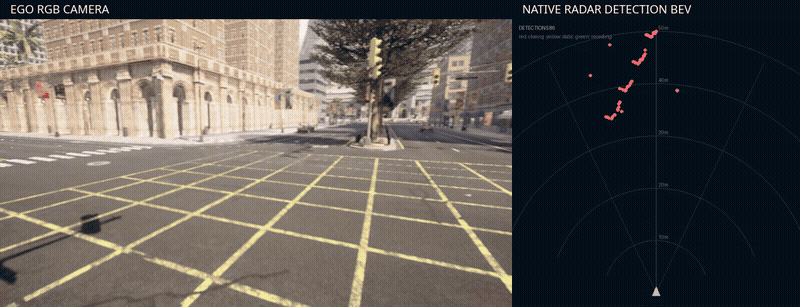
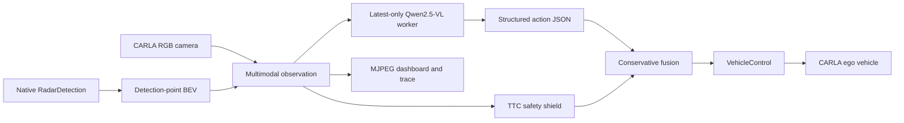

<div align="center">

# RadarMind-CARLA

**A camera-radar VLM driving agent with asynchronous inference and a deterministic safety shield**

[](https://www.python.org/)
[](https://github.com/carla-simulator/carla)
[](https://huggingface.co/Qwen/Qwen2.5-VL-3B-Instruct)
[](https://github.com/1zhiCheng/radarmind-carla/actions)
[](LICENSE)

Native RadarDetection BEV · mixed traffic · privileged teacher · LoRA SFT · TTC safety shield · live MJPEG dashboard

</div>

<p align="center">
  
</p>

<p align="center">
  <a href="assets/demo/carla_closed_loop_samples.mp4">20 FPS MP4</a> ·
  <a href="examples/verified_run_report.json">Verified run report</a> ·
  <a href="docs/VERSION_0_30_CARLA_FUSION_SFT.md">Training report</a>
</p>

> Smooth-preview provenance: 160 synchronized RGB/radar pairs were saved every 5 ticks from an 800-tick CARLA v0.30 collection run (4 Hz source). The displayed 20 FPS motion is generated with bidirectional motion-compensated interpolation; the README GIF is encoded at 12 FPS. It visualizes real ordered sensor frames, but every interpolated frame is not claimed to be a simulator observation. The live dashboard itself uses a continuous MJPEG stream.

## Highlights

- **Native radar semantics.** CARLA `RadarDetection` points (`depth`, `azimuth`, `altitude`, `velocity`) are rendered directly into a BEV. The project does not fabricate FMCW Range-Azimuth or Range-Doppler tensors.
- **Real multimodal policy.** Qwen2.5-VL consumes ego RGB, radar BEV, speed, TTC and compact radar summaries and emits structured actions.
- **Non-blocking Agent loop.** A latest-only worker moves model loading and generation off CARLA's synchronous 20 Hz tick, preventing inference backlog from freezing the simulator.
- **Safety before fluency.** The final control uses the more conservative result from the VLM and a deterministic TTC shield; stale, malformed or failed model outputs fall back safely.
- **Mixed traffic.** Vehicles, pedestrians and cyclists are spawned and moved by CARLA while the ego follows a route with Traffic Manager or a waypoint controller.
- **Teacher-to-policy pipeline.** Simulator actor state is used only for offline teacher labels; it is never passed to the deployed VLM.
- **Remote live view.** Persistent camera/radar MJPEG streams and telemetry are available through an SSH tunnel.

## Architecture



Action types are `keep_speed`, `monitor`, `slow_down`, `brake` and `emergency_brake`; the controller maps them to bounded throttle/brake/steer commands.

## Verified closed-loop run

The included report was generated in `Town10HD_Opt` with Qwen2.5-VL-3B and the CARLA fusion LoRA:

| Metric | Value |
| --- | ---: |
| CARLA ticks | 500 |
| Ego distance | 74.779 m |
| Max ego speed | 25.631 km/h |
| Moving participants | 28 |
| Vehicles / cyclists / pedestrians | 8 / 4 / 16 |
| Fresh model frames | 298 |
| Model parse errors | **0** |
| Final keep / slow / brake ticks | 113 / 333 / 54 |
| Generated RA/RD tensors | **No** |

This is an engineering regression run, not a standardized CARLA Leaderboard score. Collision, route completion, red-light violations, jerk and cross-town evaluation remain future benchmark work.

## Quick start

### 1. Requirements

- Linux with an NVIDIA GPU is recommended for CARLA and the VLM.
- CARLA server and Python client versions must match; this repository was verified with **0.9.16**.
- Docker Engine + NVIDIA Container Toolkit, or a native CARLA 0.9.16 package.
- Python 3.10+ and a CUDA-compatible PyTorch build for VLM inference/training.

### 2. Install the client and package

```bash
git clone git@github.com:1zhiCheng/radarmind-carla.git
cd radarmind-carla

conda create -n radarmind-carla python=3.11 -y
conda activate radarmind-carla
python -m pip install --upgrade pip
python -m pip install carla==0.9.16
python -m pip install -e '.[vlm,dev]'
```

Install PyTorch separately according to the CUDA driver on your host.

### 3. Start CARLA

Docker example:

```bash
docker run --rm --gpus all --net=host \
  --name carla-server carlasim/carla:0.9.16 \
  /bin/bash CarlaUE4.sh -RenderOffScreen -nosound -carla-port=2000
```

Check the server without spawning actors:

```bash
python scripts/check_setup.py --host 127.0.0.1 --port 2000
```

### 4. Run a safety-only smoke test

This validates sensors, traffic, controls and the dashboard without loading a VLM:

```bash
python -m radarmind.agent.carla_dynamic_demo \
  --output-dir runs/safety-smoke \
  --host 127.0.0.1 --port 2000 \
  --web-host 127.0.0.1 --web-port 7860 \
  --policy-mode safety --max-steps 500 \
  --npc-count 8 --cyclist-count 4 --pedestrian-count 16 \
  --ego-controller traffic_manager --no-spawn-obstacle --no-auto-reset
```

Open `http://127.0.0.1:7860` on the server. From another machine:

```bash
ssh -N -L 7860:127.0.0.1:7860 USER@SERVER_IP
```

If local port 7860 is occupied, use `-L 7861:127.0.0.1:7860` and open `http://127.0.0.1:7861`.

## Add the VLM policy

Download the base model outside Git:

```bash
hf auth login
mkdir -p models
hf download Qwen/Qwen2.5-VL-3B-Instruct \
  --local-dir models/Qwen2.5-VL-3B-Instruct
```

Run with an explicit LoRA path; this avoids any machine-specific model registry:

```bash
python -m radarmind.agent.carla_dynamic_demo \
  --output-dir runs/hybrid-vlm \
  --host 127.0.0.1 --port 2000 \
  --web-host 127.0.0.1 --web-port 7860 \
  --policy-mode hybrid \
  --model-path models/Qwen2.5-VL-3B-Instruct \
  --model-adapter-name '' \
  --model-adapter-path models/radarmind-carla-lora \
  --model-device cuda:0 --model-interval-sec 2.0 \
  --npc-count 12 --cyclist-count 5 --pedestrian-count 20 \
  --ego-controller traffic_manager --no-spawn-obstacle --no-auto-reset
```

The hybrid loop remains alive if the adapter is missing or generation fails: the worker records an error and the deterministic shield continues controlling risk.

## Train the camera-radar policy

### 1. Collect teacher trajectories

Use the same dynamic demo with `--policy-mode safety`; synchronized RGB, radar BEV, telemetry and teacher-only actor state are written to the run directory. Collect both natural traffic and obstacle-heavy episodes to avoid an all-`keep_speed` policy.

### 2. Build balanced SFT JSONL

```bash
python -m radarmind.datasets.build_carla_fusion_sft \
  --run-dir runs/natural \
  --run-dir runs/obstacle \
  --output-dir data/carla_fusion \
  --val-ratio 0.2 --seed 2026
```

The builder composes the deployed RGB + native-radar-BEV layout and creates action-balanced training records. Privileged actor state is converted into labels and is not included in online observations.

### 3. LoRA SFT

```bash
python -m radarmind.training.qwen_vl_lora_sft \
  --model-path models/Qwen2.5-VL-3B-Instruct \
  --train-jsonl data/carla_fusion/train_balanced.jsonl \
  --val-jsonl data/carla_fusion/val.jsonl \
  --output-dir models/radarmind-carla-lora \
  --device cuda:0 --dtype bf16 --gradient-checkpointing \
  --max-train-samples 0 --max-val-samples 0 \
  --batch-size 1 --gradient-accumulation-steps 4 \
  --epochs 1 --max-steps 128 --learning-rate 2e-4 \
  --lora-rank 8 --lora-alpha 16 --lora-dropout 0.05
```

See [the full v0.30 report](docs/VERSION_0_30_CARLA_FUSION_SFT.md) for schema, class balancing, training iterations and failure analysis.

## Outputs

Each run produces:

```text
runs/<name>/
├── dynamic_trace.jsonl       per-tick sensors, model output and final control source
├── dynamic_demo.report.json  aggregate environment and Agent statistics
├── snapshots/                sampled RGB and radar BEV frames
└── ...                       dashboard/runtime artifacts
```

`prediction_text` is the raw decoded VLM text; `prediction_json` is the extracted JSON object. A parsing failure is recorded explicitly and triggers safety fallback.

## Repository layout

```text
radarmind/agent/       CARLA bridges, VLM worker, teacher and safety fusion
radarmind/datasets/    CARLA trajectory -> balanced multimodal JSONL
radarmind/training/    Qwen2.5-VL LoRA SFT
radarmind/inference/   structured JSON generation and normalization
radarmind/evaluation/  action timeline and optional adapter registry
radarmind/tests/       geometry, teacher, action and safety unit tests
docs/                  detailed implementation and experiment reports
examples/              machine-readable verified-run summaries
assets/demo/           README preview, cover and MP4
```

## Sensor boundary

CARLA's radar is a ray-cast detection sensor, not a raw automotive FMCW radar. Therefore this project can validate synchronization, point geometry, multimodal reasoning, action generation and safety control, but it cannot reproduce real ADC/RD/RA signal-processing behavior. See [the radar representation decision](docs/VERSION_0_29_NATIVE_RADAR_BEV.md).

## Acknowledgement

Built with [CARLA](https://github.com/carla-simulator/carla), [Qwen2.5-VL](https://github.com/QwenLM/Qwen2.5-VL), Hugging Face Transformers and PEFT. Those projects and model weights retain their respective licenses.

## License

The repository code is released under [Apache-2.0](LICENSE). CARLA simulator binaries/assets and Qwen model weights are not redistributed.
